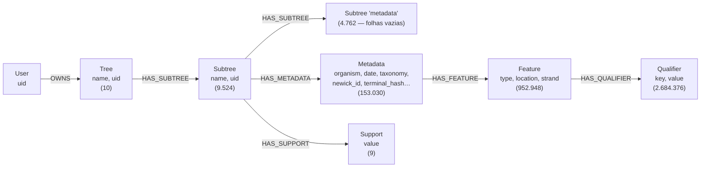
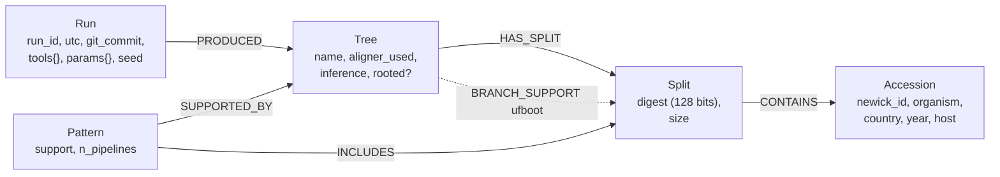

# O grafo Neo4j — o que ele contém, o que responde, e o que falta

[← Ciência](README.md) · Instância auditada: `localhost:7474`, Neo4j **2026.01.3** community, container `phylotree_neo4j` · Data: 2026-08-19

Contrato de engenharia em [`agents/12-neo4j-grafo.md`](../agents/12-neo4j-grafo.md). Aqui está o **modelo real**, medido — não o suposto —, e o que ele significa para a análise científica.

---

## 1. O achado que reorganiza tudo

> **O grafo não contém nenhum dado de *Variola*.**

```cypher
MATCH (m:Metadata) RETURN m.organism AS org, count(*) AS c ORDER BY c DESC
```

```
org           c
Zika virus    153030
```

Um único organismo, um único projeto: **Zika, 477 acessos distintos, 10 árvores** (o par MAFFT/Clustal Omega para fasttree, iqtree, nj, upgma e um `clustalo_raxml`), correspondendo a `projects/Zika_Virus_Singapura_Large_480seq`.

**Consequência.** A página **Deep Analysis** para os projetos de Variola **não lê o grafo**. Ela lê `out/outputs/all_results_fpmax.csv` e `out/outputs/metadata.json` do disco (`Backend/src/app.py:1566-1568`). Grafo e Deep Analysis são dois caminhos de dados desconexos, e nenhum documento diz isso.

Não é um defeito por si — mas cria três problemas concretos:

1. Toda pergunta interessante sobre Variola exige releitura de CSV e JSON a cada requisição, sem índice, enquanto o banco de grafos que existe para isso está ocioso.
2. A única análise que o grafo poderia acelerar (busca sobre padrões minerados, atravessar clado → sequência → metadado) está indisponível justamente para o conjunto de dados do artigo.
3. Um avaliador que abrir o Neo4j Browser do demo verá Zika e concluirá que o artigo é sobre Zika.

---

## 2. O modelo real

Levantado por introspecção (`db.labels()`, `db.relationshipTypes()`, contagens):



| Label | Nós | Propriedades |
|---|---|---|
| `Qualifier` | 2.684.376 | `key`, `value` |
| `Feature` | 952.948 | `type`, `location`, `strand` |
| `Metadata` | 153.030 | `description`, `source`, `taxonomy`, `organism`, `topology`, `date`, `molecule_type`, `newick_id`, `terminal_hash` |
| `Subtree` | 9.524 | `name`, `uid` |
| `Tree` | 10 | `name`, `uid` |
| `Support` | 9 | `value` |
| `User` | 1 | `uid` |

**Total: ~3,8 milhões de nós e ~3,8 milhões de relacionamentos para 477 registros GenBank.** Store de 898 MB no container; 2,4 GB no volume do host.

---

## 3. Quatro defeitos de modelagem

<a id="g1"></a>

### G1 · Duplicação de 321× dos metadados

```cypher
MATCH (m:Metadata)
RETURN count(m) AS nos, count(DISTINCT m.newick_id) AS acessos,
       toFloat(count(m))/count(DISTINCT m.newick_id) AS fator
```

```
nos      acessos   fator
153030   477       320.8
```

Cada registro GenBank é reinstanciado uma vez **por ocorrência de terminal em cada subárvore de cada árvore**. O efeito propaga em cascata: as 952.948 `Feature` correspondem a apenas **1.206 pares distintos `(type, location)`** — fator ~790×. Os 2,68 milhões de `Qualifier` seguem a mesma multiplicação.

**Impacto científico.** Toda agregação sobre o grafo está errada por construção. A contagem de sequências por país devolve dezenas de milhares onde há centenas:

```
geo_loc_name              c
Singapore                 25441
Brazil                    13626
Colombia: Barranquilla     7504
```

São 25.441 *ocorrências* de "Singapore", não 25.441 sequências. Qualquer painel de filogeografia que consulte o grafo em vez do disco produz números inflados por um fator que varia com a topologia das árvores — isto é, **não corrigível por uma constante**.

**Correção.** `Metadata` é uma entidade de **acesso**, não de ocorrência. Um nó por `newick_id`, com constraint de unicidade; a ocorrência é o relacionamento `(:Subtree)-[:HAS_TERMINAL]->(:Metadata)`. Redução esperada: ~3,8 M → ~50 k nós.

<a id="g2"></a>

### G2 · Metade dos nós `Subtree` é lixo do parser

```cypher
MATCH (s:Subtree) WHERE s.name = 'metadata' RETURN count(s)
```

```
4762
```

**4.762 dos 9.524 nós `Subtree` — exatamente metade — chamam-se literalmente `"metadata"`**, não têm relacionamento de saída, e são apontados por outras `Subtree` via `HAS_SUBTREE`. O ingest tratou a chave de dicionário `"metadata"` como se fosse o nome de uma subárvore.

**Impacto.** Toda travessia `(:Tree)-[:HAS_SUBTREE*]->(:Subtree)` conta o dobro de subárvores. `MATCH (t:Tree)-[:HAS_SUBTREE]->(s) RETURN count(s)` devolve 476–477 por árvore, número que **coincide** com o de táxons e por isso parece plausível — o que torna o defeito difícil de notar e mais perigoso.

**Correção.** Filtro no *parser* de ingest; e uma constraint que rejeite `Subtree` sem `terminal_hash`.

<a id="g3"></a>

### G3 · Nenhuma constraint, nenhum índice de propriedade

```cypher
SHOW CONSTRAINTS   -- vazio
SHOW INDEXES       -- apenas index_1b9dcc97 e index_460996c0 (LOOKUP, padrão do Neo4j)
```

Não há **um único** índice de propriedade em 3,8 M de nós. Toda consulta por `uid`, `newick_id` ou `q.key` é varredura completa. Todo `MERGE` do ingest é varredura completa — o que explica boa parte do custo de ingestão.

É `P-3` da auditoria, confirmado em produção. O caminho é o de [A12 §5](../agents/12-neo4j-grafo.md#5-diretrizes): constraint de unicidade **cria** índice, então `CREATE CONSTRAINT ... REQUIRE m.newick_id IS UNIQUE` resolve integridade e desempenho de uma vez — mas só **depois** de G1, porque hoje a unicidade é violada 321 vezes por acesso.

<a id="g4"></a>

### G4 · Nenhuma proveniência

Um nó `Tree` tem exatamente duas propriedades:

```
{"name": "tree_dataset_final_clustalo_fasttree", "uid": "84477226-..."}
```

Sem projeto, sem `run_id`, sem data, sem versão de ferramenta, sem parâmetro, sem digest de entrada. **Não é possível, a partir do grafo, dizer de que execução uma árvore veio** — nem sequer de que projeto. O `uid` é o particionamento por sessão anônima ([DEC-004](../automation/07-log-de-execucao.md#dec-004--2026-07-29--não-haverá-login-demo-anônimo-com-limites-rígidos-token-só-nas-rotas-administrativas)), não proveniência.

E o nome mente: `tree_dataset_final_clustalo_fasttree` — mas em Zika o Clustal Omega **de fato executou** (genomas de 10,6 kb), então aqui o rótulo está certo. Em Variola estaria errado ([D1](02-defeitos-que-alteram-resultado.md#d1)). O grafo não tem como distinguir os dois casos, porque não guarda o alinhador **usado**.

<a id="g4b"></a>

### G4b · Os nós `Support` herdam o defeito D4

Os 9 nós `Support` têm valores `0.1 … 0.9` e ligam-se a `Subtree` por `HAS_SUPPORT` (11.405 relacionamentos):

| `value` | subárvores |
|---|---|
| 0,1 | 4.762 |
| 0,2 | 3.195 |
| 0,3 | 1.298 |
| 0,4 | 1.298 |
| 0,5 | 557 |
| 0,6 | 252 |
| 0,7 | 17 |
| 0,8 | 17 |
| 0,9 | 9 |

Esses valores são os **limiares da varredura do FPMax**, não o suporte dos padrões — é [D4](02-defeitos-que-alteram-resultado.md#d4) materializado no grafo. Uma subárvore ligada a `Support{value: 0.1}` **e** a `Support{value: 0.5}` está registrada como frágil e robusta ao mesmo tempo. Note que 4.762 no nível 0,1 é exatamente o número de nós `Subtree` espúrios de G2 — os dois defeitos se sobrepõem.

E `Support` **não** carrega o suporte de ramo (bootstrap), que é o que um filogeneticista espera desse nome. O UFBoot calculado pelo IQ-TREE não chega ao grafo ([D10](02-defeitos-que-alteram-resultado.md#d10)).

---

## 4. O que o grafo poderia responder — e o modelo mínimo para isso

O grafo é a escolha certa para a pergunta central desta pesquisa: *atravessar clado → pipeline → sequência → metadado, em profundidade variável*. Isso é caro em tabela e natural em grafo. Mas o modelo atual não a suporta, porque **o clado não é uma entidade de primeira classe** — `Subtree` é local a uma árvore, então "o mesmo clado em outra árvore" não é representável por travessia.

Modelo mínimo para tornar as perguntas científicas respondíveis:



Quatro mudanças de fundo:

| Mudança | Por quê |
|---|---|
| `Split` com **digest canônico de 128 bits**, compartilhado entre árvores | Torna "o mesmo clado em N pipelines" uma travessia, e não uma junção. Elimina [D5](02-defeitos-que-alteram-resultado.md#d5) na origem |
| `Accession` único, com constraint | Elimina G1 e torna as agregações corretas |
| `Run` como raiz de proveniência | Elimina G4 e implementa o manifesto de [`04-rigor-cientifico.md §4`](../automation/04-rigor-cientifico.md#4-determinismo-e-reprodutibilidade) |
| `BRANCH_SUPPORT` como propriedade de aresta `(Tree)→(Split)` | O bootstrap é do par (árvore, split), não do split. Desbloqueia [D10](02-defeitos-que-alteram-resultado.md#d10) |

Com ele, o resultado principal do artigo vira uma consulta:

```cypher
// UFBoot alto x suporte metodologico baixo: os ramos que o bootstrap certifica
// e a troca de metodo derruba.
MATCH (r:Run {run_id: $run})-[:PRODUCED]->(t:Tree)-[b:BRANCH_SUPPORT]->(s:Split)
WHERE b.ufboot >= 95
WITH s, b.ufboot AS ufboot,
     size([(t2:Tree)-[:HAS_SPLIT]->(s) | t2]) AS n_pipelines
MATCH (r2:Run {run_id: $run})-[:PRODUCED]->(all:Tree)
WITH s, ufboot, n_pipelines, count(DISTINCT all) AS M
RETURN s.size, ufboot, n_pipelines, M, toFloat(n_pipelines)/M AS suporte_metodologico
ORDER BY suporte_metodologico ASC, ufboot DESC
LIMIT 50;
```

Hoje essa pergunta exige ler `.contree` e `.nexus` do disco com Biopython — que é o que `docs/science/scripts/audit_variola.py` faz.

---

## 5. Ordem de correção

Estritamente sequencial: cada passo depende do anterior.

1. **G2** — filtrar os `Subtree` chamados `"metadata"` no ingest. Barato, isolado, e sem ele toda contagem está dobrada.
2. **G1** — desduplicar `Metadata` → `Accession`. É a migração que reduz o grafo em ~98% e a que mais muda números.
3. **G3** — constraints e índices, com `PROFILE` antes e depois no relatório, conforme [A12 §6](../agents/12-neo4j-grafo.md#6-definition-of-done). Só faz sentido depois de G1.
4. **G4 + `Split` canônico** — o modelo de §4. É reescrita de esquema, não migração incremental.

**Todas exigem** o que [A12 §3](../agents/12-neo4j-grafo.md#3-limites) determina: script idempotente, o inverso escrito e testado em base descartável, e **backup antes** — o volume `neo4j_data/` (2,4 GB) é o ponto sem retorno deste projeto.

**Não é possível executar isto aqui.** A instância está de pé e foi lida somente para leitura. Migração é operação do usuário, com backup, e nenhuma escrita foi feita.

---

## Apêndice — consultas de introspecção usadas

```cypher
MATCH (n) RETURN labels(n) AS lbl, count(*) AS c ORDER BY c DESC;
MATCH ()-[r]->() RETURN type(r) AS t, count(*) AS c ORDER BY c DESC;
MATCH (m:Metadata) UNWIND keys(m) AS k RETURN k, count(*) AS c ORDER BY c DESC;
MATCH (m:Metadata) RETURN count(m), count(DISTINCT m.newick_id);
MATCH (s:Subtree) WHERE s.name = 'metadata' RETURN count(s);
MATCH (f:Feature) RETURN count(DISTINCT f.location + '|' + f.type), count(f);
MATCH (s:Subtree)-[:HAS_SUPPORT]->(v:Support) RETURN v.value, count(s) ORDER BY v.value;
SHOW CONSTRAINTS;  SHOW INDEXES;
```

Executadas via HTTP `POST /db/neo4j/query/v2` com a credencial de `.env`. Nenhuma escrita.
